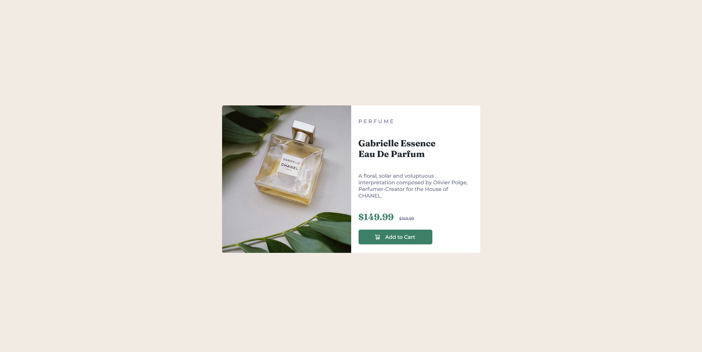

# Frontend Mentor - Product preview card component solution

This is a solution to the [Product preview card component challenge on Frontend Mentor](https://www.frontendmentor.io/challenges/product-preview-card-component-GO7UmttRfa). Frontend Mentor challenges help you improve your coding skills by building realistic projects.

## Table of contents

- [Overview](#overview)
  - [The challenge](#the-challenge)
  - [Screenshot](#screenshot)
  - [Links](#links)
- [My process](#my-process)
  - [Built with](#built-with)
  - [Continued development](#continued-development)
  - [Useful resources](#useful-resources)
- [Author](#author)
- [Acknowledgments](#acknowledgments)

**Note: Delete this note and update the table of contents based on what sections you keep.**

## Overview

### The challenge

Users should be able to:

- View the optimal layout depending on their device's screen size
- See hover and focus states for interactive elements

### Screenshot

### Links

- Solution URL: [Solution Code](https://github.com/AnalystKAL/Product-Preview-Card)
- Live Site URL: [Live Site](https://analystkal.github.io/Product-Preview-Card/)

## My process

### Built with

- Semantic HTML5 markup
- Flexbox
- CSS Grid

### Continued development

Switching between mobile and desktop view could be improved. Better layout system for each component. Add hover effects for the button.

### Useful resources

- [Guide to Flexbox](https://css-tricks.com/snippets/css/a-guide-to-flexbox/) - Full details about Flexbox by CSS Tricks.
- [HTML & CSS Full Course - Beginner to Pro (2022)](https://www.youtube.com/watch?v=G3e-cpL7ofc) - Learned some basic HTML and CSS tips from this video.

## Author

- KAL

## Acknowledgments

Special thanks to Frontend Mentor community for the valuable feedback regarding accessibility features and answering my questions.
